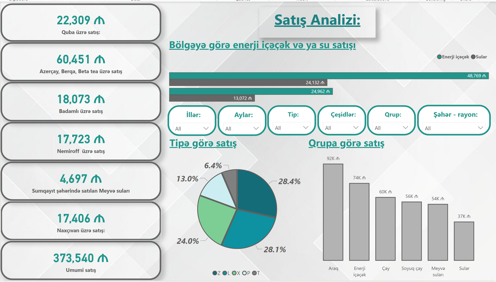

# 🛒  Sales Analysis Dashboard

This project presents a Power BI dashboard created to analyze retail sales data across different markets, cities, provinces, and products.

---

### 🔧 Tools
- Power BI  
---

### 📊 Dashboard Insights
- Total sales overview across all markets  
- Sales trends over time (monthly, quarterly, yearly)  
- Performance by store, city, province, and product category  

---

### 📁 Project Files
- Power BI dashboard: `Powerbi 2.pbix`  
- Dataset: `dataset.xlsx`  

---

### 🖼️ Screenshots
  

---
